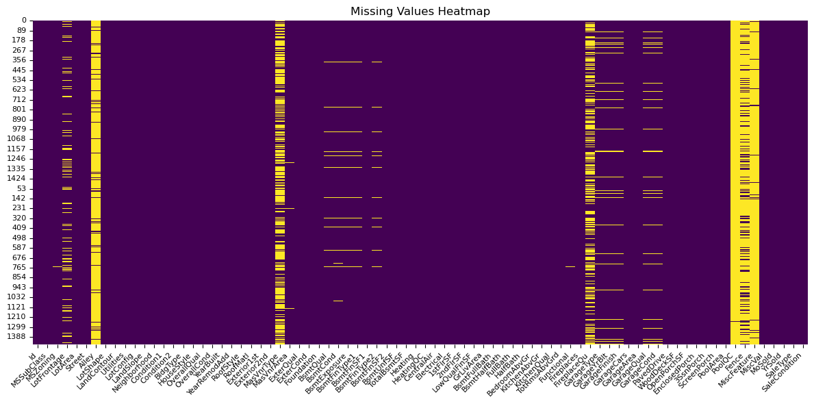
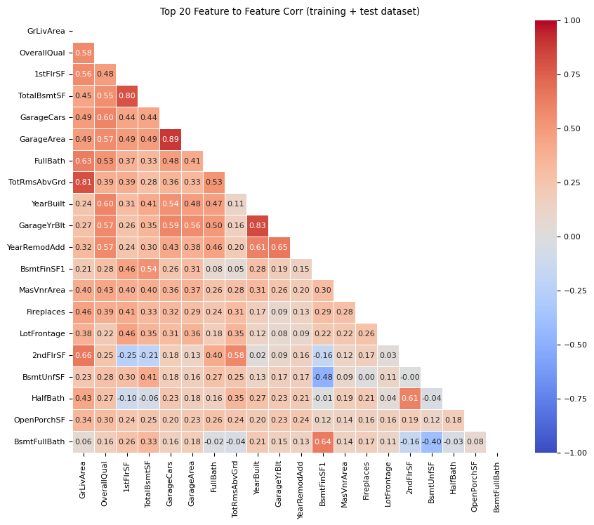
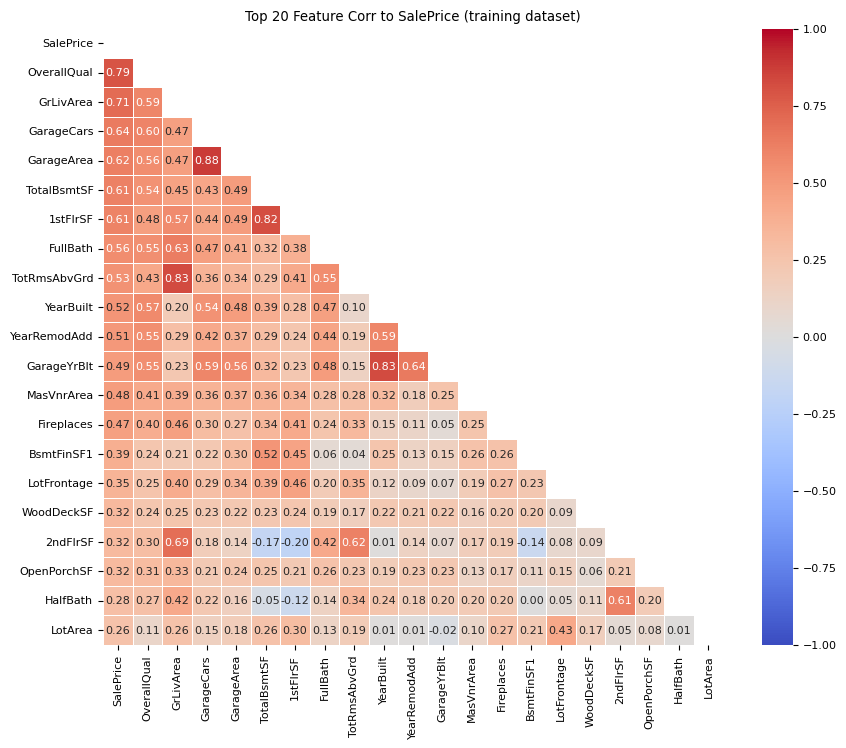
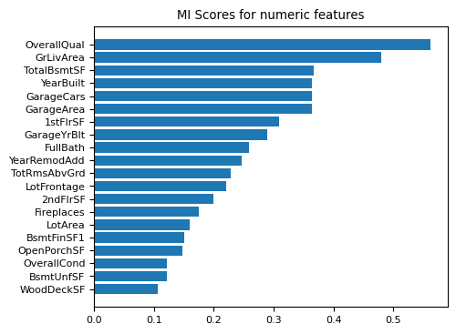
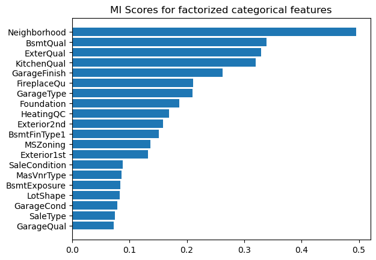
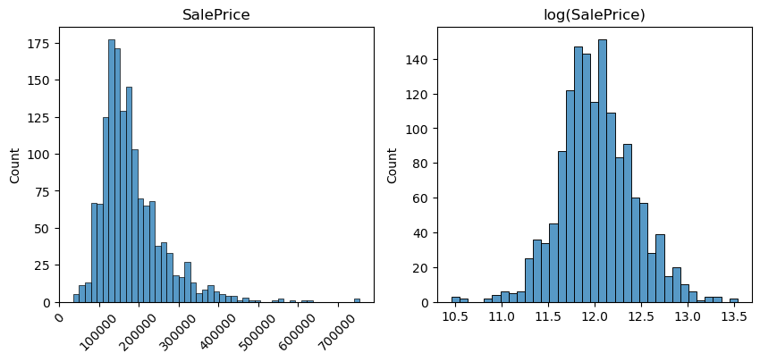

## Summary

In this project, I built a full end-to-end machine learning pipeline on the [Kaggle Ames House Prices](https://www.kaggle.com/competitions/house-prices-advanced-regression-techniques) dataset.
Using careful feature engineering and Gradient Boosting, I achieved a leaderboard score of 0.13339 (top ~2k).
The main focus was learning classical ML workflows on tabular data rather than leaderboard chasing.

This post is aimed at beginners and intermediates who want to see another's process for learning classical machine learning on tabular data.

## Evaluation

**Goal**: Predict the sales price for houses. For each `Id` in the test set, predict the value of `SalePrice`. 

**Metric**: Submissions are evaluated on Root-Mean-Squared-Error (RMSE) between the logarithm of the predicted value and the logarithm of the observed sales price.

For cross-validation, RMSE is reported on the original SalePrice scale for interpretability. Kaggle leaderboard scores are computed on log-transformed values.

## Result
1 entry. Scored 0.13339. 1964 on Leaderboard.

## Analysis

### EDA
I started with an Exploratory Data Analysis (EDA) checklist. EDA focused on missingness, sparsity, feature correlations, and target distribution — with the goal of informing imputation and scaling decisions.

Here are some interesting findings.

#### Hygiene checks
The datasets are in good condition. Their columns match (apart from the target `SalePrice`), and there is a good description in the documentation for almost all of the features. 

#### Missing values and feature categorisation
Quick missing and sparse checks on the combined training and test data.
We can see that there are missing values for several features. (yellow indicates missing/sparse values)



This directed me to an imputation strategy for all features, categorising all features into:
1. `numeric` or `categorical`
2. `structural` (missing=non-existent. eg. `PoolArea`) or `substantive` (missing=unknown. eg. `LotArea`)
3. `ordinal` or `nominal` for `categorical` features.

Here is one example of the ordinal categories for one feature:
- `Ex` Excellent
- `Gd` Good
- `TA` Typical - slight dampness allowed
- `Fa` Fair - dampness or some cracking or settling
- `Po` Poor - Severe cracking, settling, or wetness
- `NA` No Basement

I was comfortable assuming that the implied ordering reflects true value differences, while acknowledging this may not always hold perfectly.

#### Imputation strategy
At this point, I created a feature descriptor database in `src/ames/data/features.py` to capture the different classes of feature outlined above. Here is a view of it in a table:

| Feature       | Type | Sub Type    | Ordinal? |
| :------------ | :--- | :---------- | :------- |
| 1stFlrSF      | num  | substantive | False    |
| 2ndFlrSF      | num  | structural  | False    |
| 3SsnPorch     | num  | structural  | False    |
| Alley         | cat  | structural  | False    |
| BedroomAbvGr  | num  | substantive | False    |
| BldgType      | cat  | substantive | False    |
| BsmtCond      | cat  | structural  | True     |
| BsmtExposure  | cat  | structural  | True     |
| BsmtFinSF1    | num  | structural  | False    |
| BsmtFinSF2    | num  | structural  | False    |
| BsmtFinType1  | cat  | structural  | True     |
| BsmtFinType2  | cat  | structural  | True     |
| BsmtFullBath  | num  | substantive | False    |
| BsmtHalfBath  | num  | substantive | False    |
| BsmtQual      | cat  | structural  | True     |
| BsmtUnfSF     | num  | structural  | False    |
| CentralAir    | cat  | substantive | False    |
| Condition1    | cat  | structural  | False    |
| Condition2    | cat  | structural  | False    |
| Electrical    | cat  | substantive | False    |
| EnclosedPorch | num  | structural  | False    |
| ExterCond     | cat  | substantive | True     |
| Exterior1st   | cat  | substantive | False    |
| Exterior2nd   | cat  | substantive | False    |
| ExterQual     | cat  | substantive | True     |
| Fence         | cat  | structural  | False    |
| FireplaceQu   | cat  | structural  | True     |
| Fireplaces    | num  | structural  | False    |
| Foundation    | cat  | substantive | False    |
| FullBath      | num  | substantive | False    |
| Functional    | cat  | substantive | True     |
| GarageArea    | num  | structural  | False    |
| GarageCars    | num  | structural  | False    |
| GarageCond    | cat  | structural  | True     |
| GarageFinish  | cat  | structural  | True     |
| GarageQual    | cat  | structural  | True     |
| GarageType    | cat  | structural  | False    |
| GarageYrBlt   | num  | substantive | False    |
| GrLivArea     | num  | substantive | False    |
| HalfBath      | num  | substantive | False    |
| Heating       | cat  | substantive | False    |
| HeatingQC     | cat  | substantive | True     |
| HouseStyle    | cat  | substantive | False    |
| Id            | num  | substantive | False    |
| KitchenAbvGr  | num  | substantive | False    |
| KitchenQual   | cat  | substantive | True     |
| LandContour   | cat  | substantive | False    |
| LandSlope     | cat  | substantive | True     |
| LotArea       | num  | substantive | False    |
| LotConfig     | cat  | substantive | False    |
| LotFrontage   | num  | substantive | False    |
| LotShape      | cat  | substantive | False    |
| LowQualFinSF  | num  | substantive | False    |
| MasVnrArea    | num  | structural  | False    |
| MasVnrType    | cat  | structural  | False    |
| MiscFeature   | cat  | structural  | False    |
| MiscVal       | num  | structural  | False    |
| MoSold        | num  | substantive | False    |
| MSSubClass    | cat  | substantive | False    |
| MSZoning      | cat  | substantive | False    |
| Neighborhood  | cat  | substantive | False    |
| OpenPorchSF   | num  | structural  | False    |
| OverallCond   | num  | substantive | False    |
| OverallQual   | num  | substantive | False    |
| PavedDrive    | cat  | substantive | True     |
| PoolArea      | num  | structural  | False    |
| PoolQC        | cat  | structural  | True     |
| RoofMatl      | cat  | substantive | False    |
| RoofStyle     | cat  | substantive | False    |
| SaleCondition | cat  | substantive | False    |
| SaleType      | cat  | substantive | False    |
| ScreenPorch   | num  | structural  | False    |
| Street        | cat  | substantive | False    |
| TotalBsmtSF   | num  | structural  | False    |
| TotRmsAbvGrd  | num  | substantive | False    |
| Utilities     | cat  | substantive | True     |
| WoodDeckSF    | num  | structural  | False    |
| YearBuilt     | num  | substantive | False    |
| YearRemodAdd  | num  | structural  | False    |
| YrSold        | num  | substantive | False    |

#### Numeric feature correlation
The next step was to explore numeric feature<->feature correlation and feature<->target correlation.

The following image shows top correlating numeric features across both training and test datasets. If we look at the red squares above 0.8 on the heatmap, we can health check it: For example, the top scoring feature<->feature correlation is `0.89` between `GarageArea` and `GarageCars`. It is self-explanatory why these two features might correlate highly.

Seeing this heatmap sparked ideas on feature ablation tests for the Feature Engineering phase.



The following image shows the features that correlate most with the target `SalePrice`. Looking at the first column, we can see that `OverallQual` and `GrLivArea` correlate most highly. These are likely to be strong predictors of `SalePrice` in the modelling phase.


This following image shows a visual-check overview of how each feature scatterplots with `SalePrice`. I found this very useful to see which features have high sparsity, which are discrete, and which show strong linear correlation. Looking at this chart, it became clear to me that:
- `MSSubClass` is a categorical in disguise.
- `MoSold` and `YrSold` should be dropped since they exhibit no variation on `SalePrice`.
  


The following image shows the top Mutual Information scores for numerics features against `SalePrice`. Mutual Information captures both linear and non-linear dependency by estimating how much knowing one variable reduces uncertainty about the other. Again we can see some familiar features topping the list. 


#### Categorical feature correlation
The following image shows the top Mutual Information scores for categorical features against `SalePrice`. Here we can see for the first time how strong `Neighborhood` is as a predictor of `SalePrice`.

This checks out intuitively. Anyone who has thought about house prices for more than a few seconds knows that *location* really matters when it comes to house prices.


#### Target encoding
Target encoding was straight-forward since Kaggle specified it in the competition brief. They want competitors to predict the logarithm of the target. I did some analysis to see why this makes sense.

When we look at the distribution for `SalePrice` we observe that it is never negative, it is right skewed, and it has some high outliers. We don't want to ignore the high outliers since big house prices are important data points. But we want to find a way to make the distribution more balanced and suitable for linear modelling.

The left hand side is the distribution of `SalePrice`. The right hand side of this image is the log distribution. We can see that the log distribution is more balanced, and the effect of the outliers has been reduced. This makes it more suitable for linear modelling.



#### Categorical encoding
Categorical features can be split into `ordinal` and `nominal` features. For the `ordinal` features, the decision was straightforward. I would use `OrdinalEncoder`. For the `nominal` features, the options are either to:
- one hot encode
- drop
- make binary

I investigated the top cardinality of the categorical nominal features across training and test datasets:

| Feature      | Cardinality |
| ------------ | ----------- |
| Neighborhood | 25          |
| Exterior2nd  | 15          |
| Exterior1st  | 13          |
| SaleType     | 9           |
| Condition1   | 9           |

You can see that there isn't high cardinality in these datasets. `Neighborhood` has the highest, but we know this is a strong predictor of `SalePrice` so we don't want to lose any information here. And even then it's only 25.

My thinking at this point was to one-hot encode all categorical nominal features.

One experiment might be to ignore feature categories with low frequency using the `min_frequency` parameter of `OneHotEncoder`.

#### Numeric scaling
In this project I wanted to explore both linear and tree-based models. Linear models require appropriate scaling of all numeric features. So I went through all the numeric features and analysed what scaling might be appropriate. This is what I came up with:

| Feature       | key stats                               | Strategy                                                | Reason                                                           |
| ------------- | --------------------------------------- | ------------------------------------------------------- | ---------------------------------------------------------------- |
| 1stFlrSF      | skew=1.37, sparse=0.0, outlier=0.013    | Log Scale                                               | Right skew, meaningful high outliers                             |
| 2ndFlrSF      | skew=0.81, sparse=0.56, outlier=0.001   | Split in "has2ndFlr" and "SecondFlrSF". Then Standard.  | High sparsity. once split has limited skew                       |
| 3SsnPorch     | skew=10.29, sparsen=0.98 outlier=0.016  | Make binary: "has3SsnPorch"                             | Very high sparsity. poor predictor of saleprice                  |
| BedroomAbvGr  | skew=0.21, sparsen=0.00 outlier=0.023   | Standard Scale                                          | Discrete. distribution                                           |
| BsmtFinSF1    | skew=1.68, sparsen=0.31 outlier=0.004   | Split in "hasBsmt1" and "BsmtSF1". Then Standard        | High sparsity. once split has limited skew                       |
| BsmtFinSF2    | skew=4.25, sparsen=0.88 outlier=0.114   | Make binary: "hasBsmt2"                                 | Very high sparsity. poor predictor of saleprice                  |
| BsmtFullBath  | skew=0.59, sparsen=0.58 outlier=0.00    | Standard Scale                                          | Discrete distribution with low max                               |
| BsmtHalfBath  | skew=4.0, sparse=0.94 outlier=0.05      | Standard Scale                                          | Very high sparsity, discrete distribution                        |
| BsmtUnfSF     | skew=0.91, sparse=0.08, outlier=0.019   | Robust Scale                                            | Poisson-style dist.                                              |
| EnclosedPorch | skew=3.08, sparse=0.85, outlier=0.142   | Split in "hasEnclosedPorch" and "EnclosedPorchSF".      | High sparsity. once split has limited skew                       |
| Fireplaces    | skew=0.648, sparse=0.47, outlier=0.003  | Standard Scale                                          | Discrete distribution with low max                               |
| FullBath      | skew=0.036, sparse=0.00, outlier=0.000  | Standard Scale                                          | Discrete distribution with low max                               |
| GarageArea    | skew=0.179, sparse=0.05, outlier=0.014  | Split in "hasGarage" and "GarageSF". Then Standard      | Sparsity takes away from distribution                            |
| GarageCars    | skew=-0.342, sparse=0.05, outlier=0.003 | Standard Scale                                          | Discrete distribution with low max                               |
| GarageYrBlt   | skew=-0.677, sparse=0.00, outlier=0.000 | Standard Scale                                          | Preserve increase in years                                       |
| GrLivArea     | skew=1.365, sparse=0.00, outlier=0.021  | Log Scale                                               | Right skew, meaningful high outliers                             |
| HalfBath      | skew=0.675, sparse=0.62, outlier=0.000  | Standard Scale                                          | Discrete distribution with low max                               |
| Id            | skew=0.000, sparse=0.00, outlier=0.000  | Drop                                                    | Id not required                                                  |
| KitchenAbvGr  | skew=4.483, sparse=0.00, outlier=0.046  | Standard Scale                                          | Discrete distribution with low max                               |
| LotArea       | skew=12.195, sparse=0.00, outlier=0.047 | Log Scale                                               | Right skew, meaningful high outliers                             |
| LotFrontage   | skew=2.406, sparse=0.00, outlier=0.072  | Log Scale                                               | Right skew, meaningful high outliers                             |
| LowQualFinSF  | skew=9.002, sparse=0.98, outlier=0.017  | Make binary: "hasLowQualSF"                             | Very high sparsity. poor predictor of saleprice                  |
| MasVnrArea    | skew=2.674, sparse=0.59, outlier=0.067  | Split in "HasMasVnrArea" and "MasVnrSF". Then Standard  | High sparsity. once split has limited skew                       |
| MiscVal       | skew=24.451, sparse=0.96, outlier=0.035 | Drop                                                    | Even when split, I can't see a linear correlation with saleprice |
| MoSold        | skew=0.211, sparse=0.00, outlier=0.000  | Drop                                                    | No relationship to sale price                                    |
| MSSubClass    | skew=1.406, sparse=0.00, outlier=0.070  | Turn to categorical. one-hot encode.                    | Not a numeric feature                                            |
| OpenPorchSF   | skew=2.361, sparse=0.44, outlier=0.052  | Split in "hasOpenPorch" and "OpenPorchSF".              | High sparsity. once split has limited skew                       |
| OverallCond   | skew=0.692, sparse=0.00, outlier=0.085  | Standard Scale                                          | Discrete distribution with low max                               |
| OverallQual   | skew=0.216, sparse=0.00, outlier=0.001  | Standard Scale                                          | Discrete distribution with low max                               |
| PoolArea      | skew=14.813, sparse=0.99, outlier=0.004 | Make binary: "hasPool"                                  | Very high sparsity. poor predictor of saleprice                  |
| ScreenPorch   | skew=4.117, sparse=0.92, outlier=0.079  | Split in "hasScreenPorch" and "ScreenPorchSF"           | High sparsity. once split has limited skew                       |
| TotalBsmtSF   | skew=1.522, sparse=0.02, outlier=0.041  | Split in "hasBsmt" and "BsmtSF". Then Standard.         | Exclude zeros to reveal distribution                             |
| TotRmsAbvGrd  | skew=0.675, sparse=0.00, outlier=0.020  | Standard Scale                                          | Discrete distribution with low max                               |
| WoodDeckSF    | skew=1.539, sparse=0.52, outlier=0.021  | Split in "hasWoodDeck" and "WoodDeckSF". Then Standard. | High sparsity. once split has limited skew                       |
| YearBuilt     | skew=-0.612, sparse=0.00, outlier=0.004 | Standard Scale                                          | Preserve year to year scale                                      |
| YearRemodAdd  | skew=-0.503, sparse=0.00, outlier=0.000 | Standard Scale                                          | Preserve year to year scale                                      |
| YrSold        | skew=0.096, sparse=0.00, outlier=0.000  | Drop                                                    | No relationship to sale price                                    |

The process of building this table allowed me to group the features into classes. When grouped, these are the overarching heuristics:
- Sparse & low correlation -> binary
- Sparse & high correlation -> zero flag + distribution
- Right-skewed & continuous -> log
- Discrete small counts -> standard
- Poisson-like, mild outliers -> robust
- Irrelevant -> drop
- Categorical in disguise -> one-hot

## Modelling
With the EDA complete, my next step was to choose some models and establish baselines.

### Choose models
The goal of this project was to explore linear and tree-based models. The models I wanted to evaluate were the following:

| Base Type | Model                        | Reason                                                                                           |
| --------- | ---------------------------- | ------------------------------------------------------------------------------------------------ |
| Linear    | Ordinary Least Squares (OLS) | Rough baseline, zero-cost training                                                               |
| Linear    | Lasso                        | See how it compares with OLS                                                                     |
| Linear    | Ridge                        | L2 regularization could work well with this dataset                                              |
| Linear    | ElasticNet                   | Curious how this would compare against Lasso and Ridge                                           |
| Tree      | RandomForest                 | Get a baseline for how tree models cope with this dataset                                        |
| Tree      | GradientBoost                | Compare against RandomForest. Could the shallow tree depth be stronger against overfitting here? |
| Tree      | AdaBoost                     | Comparison to other tree-based models                                                            |

### Setup decisions
- Use sklearn `Pipeline` to avoid gotchas with preprocessing.
- Use Cross Validation to avoid overfitting. Use `n_splits=10` as a reasonable default.
- Use manual Grid Search to find hyperparameter ranges. This avoid introducing complex dependencies when I'm trying to learn.

### Establishing a baseline
The next step was to establish a baseline pipeline, that does imputing, encoding, and modelling.
My decision for the baseline was to:
- Drop `Id`, `MoSold`
- Impute all features' missing values
- `StandardScaler` for all numeric features
- `OneHotEncoder` for all categorical nominal features
- `OrdinalEncoder` for all categorical ordinal features

My baseline imputation strategy was as follows:
```python
# numeric structural
SimpleImputer(strategy="constant", fill_value=0)
# numeric substantive
SimpleImputer(strategy="median", add_indicator=True)
# categorical structural
SimpleImputer(strategy="constant", fill_value="NA")
# categorical substantive
SimpleImputer(strategy="constant", fill_value="Unknown")
# categorical ordinal structural
SimpleImputer(strategy="constant", fill_value="NA")
# categorical ordinal substantive
SimpleImputer(strategy="most_frequent", add_indicator=True)
```

#### Baseline results
With some rough grid search for hyperparameters, these were the initial baseline results with `cv_params = {"n_splits": 10}` and commit short hash `5a67de1`:
| Model                        | Hyperparameters                                               | RMSE     |
| ---------------------------- | ------------------------------------------------------------- | -------- |
| Ordinary Least Squares (OLS) | n/a                                                           | 40986.26 |
| Lasso                        | `{"alpha": 0.01}`                                             | 42407.55 |
| Ridge                        | `{"alpha": 1}`                                                | 37591.72 |
| ElasticNet                   | `{"l1_ratio": 1e-7,"alpha": 1}`                               | 37825.40 |
| RandomForest                 | `{"n_estimators": 600, "max_depth": 11}`                      | 28678.29 |
| GradientBoost                | `{"n_estimators": 450, "learning_rate": 0.2, "max_depth": 2}` | 24304.67 |
| AdaBoost                     | `{"n_estimators": 650, "learning_rate": 1}`                   | 33985.59 |

We can see that GradientBoost outperforms all other models, and the linear models perform worse than the tree-based models on the baseline pipeline.

At this stage, I decided to move forward with Ridge, RandomForest & GradientBoost.

I was curious to see if I could get the Ridge model working better with feature scaling.

### Feature Engineering
#### Custom scaling
This experiment was to implement custom scaling as described above, for all numeric features to improve linear models.
As expected, we observe strong improvement in the Ridge model, but no improvement in the GradientBoost.

commit short hash `5a67de1`:
| Model         | Preprocessor | Hyperparameters                                               | RMSE     |
| ------------- | ------------ | ------------------------------------------------------------- | -------- |
| Ridge         | Baseline     | `{"alpha": 1}`                                                | 37591.72 |
| Ridge         | Scaling      | `{"alpha": 1}`                                                | 32298.81 |
| GradientBoost | Baseline     | `{"n_estimators": 450, "learning_rate": 0.2, "max_depth": 2}` | 24437.50 |
| GradientBoost | Scaling      | `{"n_estimators": 450, "learning_rate": 0.2, "max_depth": 2}` | 24877.34 |

At this point, I decided to move forward just with GradientBoost, due to its performance.

#### Ablation
I attempted a number of different ablation strategies with GradientBoost and couldn't improve on the score. In practice, Gradient Boosting proved robust to feature ablation; removing correlated or weak features did not improve validation RMSE.

#### Computed features
In this experiment, I introduce 2 new features:
- Total square footage: `TotalSF = 1stFlrSF + 2ndFlrSF + TotalBsmtSF`
Square footage per room above ground: `SqftPerRmAbvGr = TotalSF / (TotRmsAbvGrd + FullBath)`

commit short hash `5a67de1`:
| Model         | Preprocessor | Hyperparameters                                               | RMSE     |
| ------------- | ------------ | ------------------------------------------------------------- | -------- |
| GradientBoost | Baseline     | `{"n_estimators": 450, "learning_rate": 0.2, "max_depth": 2}` | 24426.31 |
| GradientBoost | Computed     | `{"n_estimators": 450, "learning_rate": 0.2, "max_depth": 2}` | 23962.42 |

We observe that these computed features do improve GradientBoost. GradientBoost benefits from computed feature interaction more effectively than any ablation or scaling.

### Final tuning
Now with GradientBoost running on the Computed Values Preprocessor, I went forward with some final tuning.
Sticking with cross validation `n_splits=10`, I was able to grid search improved parameters for GradientBoost:

commit short hash `5a67de1`:
| Model         | Preprocessor | Hyperparameters                                               | RMSE     |
| ------------- | ------------ | ------------------------------------------------------------- | -------- |
| GradientBoost | Computed     | `{"n_estimators": 500, "learning_rate": 0.2, "max_depth": 2}` | 23364.31 |

This was the final tuned model, achieving an RMSE of $23,364.31 under 10-fold cross-validation.

## Submission
The final model is stored in `src/ames/models/best.py`
The predictions can be run with:
```bash
# Create submission.csv in folder
conda activate ames
python ./src/ames/models/best.py
```

## Learnings
I learned a huge amount on this project. Beforehand I had never run any ML models, and I had never entered into a Kaggle competition. I learned from scratch all about:
- Linear regression with OLS, Lasso, Ridge
- Tree-based regression with Random Forest and Gradient Boost
- EDA, sparsity, distributions
- Data cleaning and imputation
- Feature engineering and baseline testing
- Correlation, both with regression and Mutual Information
- Encoding strategies
- python packages `sklearn` ,`pandas`, `scipy`
- Preprocessor pipelines
- Feature dicts
- Hyperparameter tuning
- Cross Validation

The biggest surprise to me was how much time I had to spend on preprocessing compared to running models. Perhaps 70% of the time spent was in EDA and preprocessing. I also had to spend a lot of time understanding the architecture of the models to gain an intuitive sense of how to improve their performance, for example why scaling improves linear models but not tree-based models.

### What I didn’t focus on
- Extensive leaderboard tuning
- Advanced boosting libraries (XGBoost / LightGBM)
- Ensembling or stacking

These were deliberately avoided to keep the focus on fundamentals.

If I were to take this further I might look into:
- XGBoost / LightGBM
- Target encoding for Neighborhood
- Bayesian hyperparameter search
- Out-of-fold stacking
- SHAP for interpretability

### Key Takeaways
- Preprocessing is where all your time goes
- Tree models love feature interactions
- Linear models love well-considered scaling
