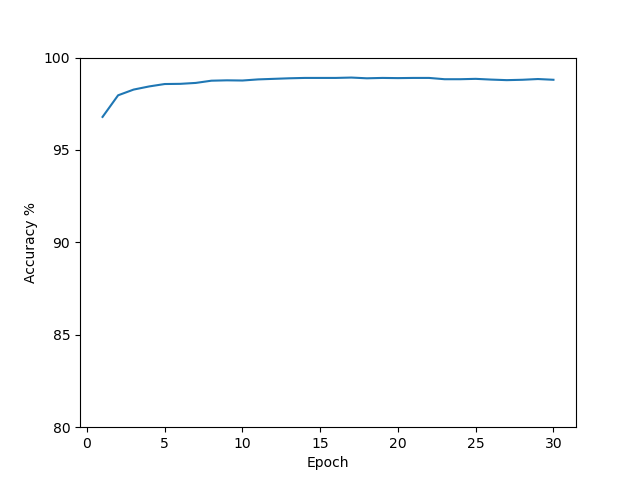

## Overview
In this post, I note down my learnings from reading Neural Networks and Deep Learning by Michael Nielsen. At the end, I also provide the code I wrote in PyTorch, and the classification accuracy I was able to achieve for MNIST.

Author: Michael Nielsen
Book: http://neuralnetworksanddeeplearning.com/

This book took me a long time to finish. It is incredibly dense with information and requires focused concentration, which made it hard to dip in and out for short periods of time. It required multi-hour long sessions where I read a section, and then tackled the exercises. I re-read it around 4 times, perhaps more. 

This is because I found it to be immensely rewarding. The time I put in was well worth it. I feel like this book fast-forwarded me months in terms of learning about AI and Neural Networks.

Overall I was immensely impressed by this book. Despite the first version being written in 2013, Nielsen's focus on the fundamentals principles of Neural Networks means that all the components and algorithms he outlines are mostly still relevant today. The only out-of-date bits are parts of the python code he uses. In any case, updating the code to run was trivial.

I learned about:
- perceptrons and neurons
- weights and biases
- activation functions:
	- Sigmoid
	- Tanh
	- Softmax
	- ReLU
- Layered deep neural networks
- Gradient descent and Stochastic Gradient Descent
	- Hessian Technique
	- Momentum based gradient descent
- Cost functions
	- Quadratic
	- Cross Entropy
	- Log Likelihood
- Training, Validating, Testing
- Hyperparameters
- Backpropagation
- Regularisation
- Weight initialisation
- Convolution Nets
- Vanishing & Exploding Gradient Problem

From what I can gather, grokking this book represents a solid foundation towards understanding modern LLMs and other modern AIs.

The next steps I plan to take are learning about, Recurrent Neural Networks (RNN), Attention, and the infamous Transformer.
## Pre-requisites
This book does requires some prior knowledge. Although Nielsen suggests that the mathematics required is elementary, I found that I needed to do some maths and coding homework in order to get a solid grasp of this book. If you have a Maths or Maths-adjacent degree, you should be ready to go. You need:
- Calculus
	- chain rule
	- product rule
	- power rule
	- $e$, $\ln$ and how they differentiate and integrate
	- Taylor series approximations
- Linear algebra
	- vectors
	- matrices
	- dot product
	- transpose
- Probability
	- mean, variance, standard deviation
	- probability distributions
- Coding
	- python
	- numpy
	- matplotlib
## Learnings
#### Perceptron
A Perceptron takes binary input and produces binary output. Given and input vector $x$, a weights vector $w$, and a bias $b$, the output is defined as:
$$
output = \begin{cases} 0 &\text{if } w \cdot x + b \leq 0 \\ 1 &\text{if } w \cdot x + b \gt 0 \end{cases}
$$
#### Sigmoid Neuron
A Sigmoid Neuron is similar in structure to a Perceptron but differs in a crucial way: instead of producing a hard binary output, it produces a continuous output between 0 and 1.

The Neuron computes the same weighted sum:  $z = w \cdot x + b$
but passes it through the Sigmoid function: $\sigma(z) \equiv \frac{1}{1 + e^{-z}}$

Unlike a Perceptron:
- The inputs xix_ixi​ can be any real-valued numbers (often normalized in practice).
- The output is a real number in the interval $(0,1)$, rather than a strict 0 or 1.


This function is especially useful because it is smooth and differentiable everywhere. Small changes in the weights or bias lead to small changes in the output.
#### MNIST Dataset
The MNIST dataset is a set of handwritten digits, where each image is grayscale and sized at 28x28 pixels. It consists of 60,000 training images and 10,000 test images. For many years, MNIST served as the standard benchmark for evaluating neural network performance.
#### Cost functions (also called Loss)
Suppose we have a function (or neural network) that, for a given input $x$, is expected to produce the output $y$., but the actual output is $a(x)$, then a cost function is designed to quantify how far away $a(x)$ is from $y$.

Intuitively:
- If the network’s output matches the target exactly, the cost should be very small, or even 0.
- As the output deviates further from the target, the cost should increase.

Importantly, we want the cost function to be continuous and differentiable, so that small changes in the network’s weights and biases lead to small changes in the cost. This allows us to efficiently optimize the network using gradient-based methods such as gradient descent.

**Quadratic Cost** is a commonly used cost function with the following definition:
$$
 C(w, b) \equiv \frac{1}{2n}\sum_{x}\Vert y(x) - a(x)\Vert^2
$$
$C(w,b)$ is total Cost
$w$ is all weights in the network
$b$ is all the biases in the network
$n$ is total number of training inputs
$y(x)$ is expected output for input $x$
$a(x)$ is output when input $x$
‖v‖ is length function (Euclidean Norm) for a vector $v$
#### Gradient Descent
Gradient Descent is an optimization algorithm that iteratively takes small steps in the direction of steepest descent to minimize a cost function.

Suppose we have a cost function $C(v)$, where each($(v_i,...,v_m)$ represents the parameters of a model. For each $v_i$, we can compute the partial derivative $\frac{\partial C}{\partial v_i}$. Collecting these derivatives gives the gradient vector
$$
\nabla C = \left(\frac{\partial C}{\partial v_1},...,\frac{\partial C}{\partial v_m} \right)^T
$$
Using first-order Taylor approximation, small changes in the cost can be approximated by $\triangle C \approx \nabla C \cdot \triangle v$. 

Then, with a judiciously chosen learning rate $\eta$ we can take discrete downwards steps in the direction of the steepest gradient using the expression $v \to v' = v - \eta\nabla C$

By repeatedly applying this update, we move toward a (local) minimum of the cost function.

**Stochastic Gradient Descent** (SGD) builds on the above to make training practical for larger datasets.

In standard Gradient Descent, computing the gradient requires evaluating the cost function over the entire training set, which can be computationally expensive. SGD addresses this by approximating the gradient using a small subset of the dataset called a mini-batch.

Instead of computing the exact gradient for the whole dataset, we compute an estimate using only the mini-batch. While this is only an estimate of the gradient for the whole dataset, it is usually close enough to the true gradient to make some progress in the right direction, and it dramatically speeds up training, so the tradeoff is worth it.

For a mini-batch of size $m$, the update rules for the weights $w_k$ and biases $b_l$ are:
$$
w_k \to w'_k = w_k - \frac{\eta}{m}\sum_j\frac{\partial C_{X_j}}{\partial w_k}
$$
$$
b_l \to b'_l = b_l - \frac{\eta}{m}\sum_j\frac{\partial C_{X_j}}{\partial b_l}
$$
where $C_{X_j}$ is the Cost associated with the $j$-th training example in the mini-batch.
#### Backpropagation
Backprop is the workhorse algorithm that makes training deep neural networks practical. Naively computing gradients—for example, using finite differences—would require a full forward pass for every weight and bias, which is prohibitively expensive. Backprop avoids this by leveraging the chain rule to reuse intermediate results and compute all gradients in a single backward pass.

Backprop efficiently computes the gradients of the cost function with respect to all weights and biases, by propagating error signals backward through the network after a forward pass, calculating each $\frac{\partial C_X}{\partial w}$ and $\frac{\partial C_X}{\partial b}$ as it goes.

**Assumptions**
For Backprop, we make two assumptions about the cost function:
1. Overall cost function is an average of cost functions for individual training examples. ie. $C = \frac{1}{n}\sum_X C_X$ . This allows us to compute $\partial C / \partial w$ from all the individual $\partial C_X / \partial w$ 
2. The cost depends on the network only through its output activations. 

**Layer-wise activations**
If we view the activations $a$ of layer $l$ as a function of the previous layer $l-1$, then in vector form we can define $a^l = \sigma(w^la^{l-1} + b^l)$ . let's also define $z^l = w^la^{l-1} + b^l$ so $a^l = \sigma(z^l)$.

**Error**
We define the error $\delta^l_{j}$ of neuron $j$ in layer $l$ as:
$\delta^l_j \equiv \partial C / \partial z^l_j$ . Intuitively, the error measures how sensitive the total cost is to changes in the weighted input of a specific neuron.

**The four fundamental equations for backprop**
To propagate back through the network, we need to calculate:
1. Error $\delta^L$ in the output layer $L$
2. the error in layer $l$ given the error in the next layer $l+1$. (dependent on 1)
3. $\partial C / \partial w^l_{jk}$ given the error $\delta^l_j$ and activation $a^{l-1}_k$ (dependent on 2, and the activations from forward pass)
4. $\partial C / \partial b^l_j$ given the error $\delta^l_j$ (dependent on 2)

The 4 fundamental equations for backprop are therefore:

Equation for the component-wise error in the output layer $\delta^L$:
$$
\delta^L_j = \frac{\partial C}{\partial a^L_{j}}\sigma'(z^L_{j})
$$
or the vector form:
$$
\delta^L = \nabla_{a}C\space\odot\space\sigma'(z^L)
$$
(where ⊙ denotes Hadamard product)

Equation for the error $\delta^l$ in terms of the error in the next layer $\delta^{l+1}$:
$$
\delta^l = ((w^{l+1})^T\delta^{l+1})\space\odot\space\sigma'(z^l) 
$$
Equation for the rate of change of the cost with respect to any bias in the network:
$$
\frac{\partial C}{\partial b^l_{j}} = \delta^l_{j}
$$
Equation for the rate of change of the cost with respect to any weight in the network:
$$
\frac{\partial C}{\partial w^l_{jk}} = a^{l-1}_{k}\delta^l_{j}
$$
**The backpropagation algorithm**
1. Input: set activation for input layer $a^1$
2. Feedforward: for each layer 2,..,L, compute $z^l = w^l a^{l-1} + b^l$ and $a^l = \sigma(z^l)$ 
3. Output error $\delta^L$: Compute $\delta^L = \nabla_aC \odot \sigma'(z^L)$ 
4. Backpropagate the error: For each l = L - 1,...,2 compute $\delta^l = ((w^{l+1})^T\delta^{l+1}) \odot \sigma'(z^l)$ 
5. Output: Calculate the gradient of the cost function with respect to individual weights and biases using $\frac{\partial C}{\partial w^l_{jk}} = a_{k}^{l-1}\delta^l_{j}$ and $\frac{\partial C}{\partial b^l_{j}} = \delta^l_{j}$
 

Backprop is typically combined with SGD to run the learning algorithm, with SGD being responsible for using the backpropagation output to adjust the weights and biases.

The algorithm being, for each $l = L, L-1,...,2$ update the weights according to the rule $w^l \to w^l - \frac{\eta}{m}\sum_x\delta^{x,l}(a^{x,l-1})^T$ and the biases according to the rule $b^l \to b^l - \frac{\eta}{m}\sum_x\delta^{x,l}$, where $m$ is the size of the mini-batch.
#### Cross Entropy Cost
Cross-entropy is an alternative cost function designed to address the problem of slow learning when the output layer uses the sigmoid activation function. It can be thought of as a particularly well-matched pairing with sigmoid neurons.

As we saw above, the error of an output neuron is defined as:
$$
\delta^L_j = \partial C / \partial z^L_j
$$

Using the chain rule via the activation $a^L_j$, we obtain:
$$
\delta^L_j = \frac{\partial C}{\partial a^L_j}\sigma'(z^L_j)
$$
In the exercises we verify that $\sigma'(z) = \sigma(z)(1- \sigma(z))$.

The problem with this expression is that $\sigma'(z)$ becomes very small when the activation $\sigma(z)$ is close to 1 or 0. As a result, the gradients $\partial C / \partial w$ and $\partial C / \partial b$ also become small. During gradient descent, this causes the neurons to 'learn slowly'.

We want neurons to learn quickly when they are very wrong, and slowly only when they are close to the correct answer.

However, with the sigmoid activation function, the neuron can 'saturate' (ie. $\sigma(z) \approx 0\space or\space 1$) even when the prediction is highly incorrect. In these cases, learning slows down precisely when we want it to speed up.

This motivates the question: Can we design a cost function, such that the troublesome $\sigma'(z)$  is cancelled out when calculating the gradient?

The answer is the Cross Entropy cost, defined as:
$$
C = - \frac{1}{n} \sum_x \sum_j [y_j\space ln\space a^L_j + (1 - y_j)\space ln(1 - a^L_j)]
$$
$x$ = a training example
$n$ = number of training examples
$j$ = output neuron index
$y$ = expected output
$a$ = actual output

When we differentiate $C$ with respect to $w_j$ , the CrossEntropy function is cleverly designed so the $\sigma'(z)$  cancels out, leaving:
$$
\frac{\partial C}{\partial w_j} = \frac{1}{n} \sum_x x_j(a^L_j - y_j)
$$
The same goes for biases:
$$
\frac{\partial C}{\partial b} = \frac{1}{n} \sum_x(a^L_j - y_j)
$$
The quantity $a - y$ represents the output error. Crucially, the gradients now depend directly on this error, rather than being suppressed by the sigmoid derivative. As a result, learning proceeds faster when the neuron is very wrong, and slows down naturally as it approaches the correct output.

Softmax is an activation function commonly used in the output layer for multiclass classification, where it often replaces the sigmoid function. Unlike Sigmoid, Softmax considers the entire output layer jointly rather than treating each neuron independently.

The activation of neuron $j$ in the output layer $L$ is given by:
$$
a^L_j = \frac{e^{z^L_j}}{\sum_k e^{z^L_k}}
$$
where $z^L_j$ is the weighted input to neuron $j$, and the sum runs over all $k$ neurons in the output layer.

This definition has two important properties:
- The activations of all output neurons sum to 1, forming a valid probability distribution.
- All activations are positive, allowing each output to be interpreted as the model’s estimated probability for a given class.

Because of these properties, Softmax is especially well-suited for classification problems where exactly one class is correct.
#### Log Likelihood
When Softmax is used in the output layer, the negative Log Likelihood cost $C \equiv -\ln a^L_y$ is typically used. This is equivalent to categorical cross-entropy for one-hot targets. The Softmax + Log Likelihood pairing yields a particularly simple gradient, $\partial C/ \partial z^L_j=a^L_j−y_j$, which improves learning in much the same way that Cross Entropy does for Sigmoid outputs.
#### Overfitting
Overfitting is a well-known phenomenon in which a model fits the peculiarities of its training data too closely, rather than learning a generalizable structure that performs well on unseen data.

Common strategies to mitigate overfitting include:
- Early stopping: monitoring performance on a validation dataset as training progresses. If the validation loss stops improving (or begins to increase) while training loss continues to decrease, the model is likely starting to overfit, and training can be halted early.
- Increasing the size of the training dataset: more data makes it harder for the model to memorize individual examples and encourages better generalisation.
- Regularisation (see below)
- Weight Initalisation (see below)

The roles of the different datasets are:
- Training data: used to learn the model’s parameters (e.g., weights and biases).
- Validation data: held out during training and used to tune hyperparameters and guide decisions such as early stopping.
- Test data: used only after training is complete to evaluate how well the model generalizes to unseen data.
#### Regularisation
Regularisation techniques reduce overfitting by discouraging overly complex models. One common technique, known as Weight Decay or L2 Regularisation, adds an extra term to the cost function called the regularisation term. eg.
$$
C = -\frac{1}{n}\sum_{xj}\left[y_j\ln a^L_j + (1-y_j)\ln(1 - a^L_j)\right] + \frac{\lambda}{2n}\sum_ww^2
$$

Here, the first term is the Cross Entropy cost, and the second term penalises large weights. The sum runs over all weights in the network (biases are typically excluded).  
$\lambda$ is the regularisation parameter, and $n$ is the size of the training set.

Intuitively, regularisation encourages the network to learn small weights, all else being equal. Among models that fit the training data similarly well, those with smaller weights are preferred.

Different types of regularisation include:
- L1 Reg:  $C = C_0 +\frac{\lambda}{n} \sum_w|w|$
- L2 Reg (weight decay):  $C = C_0 + \frac{\lambda}{2n}\sum_ww^2$ 
- Dropout: randomly omitting neurons during training to prevent co-adaptation

**Why does weight decay work?**
In chapter 3, Nielsen states: *"Heuristically, if the cost function is unregularized, then the length of the weight vector is likely to grow, all other things being equal. Over time this can lead to the weight vector being very large indeed."*

This confused me at first. Neilsen doesn't give a solid reason. Why would the weight vector grow during gradient descent?

The answer I found is that larger weights make the neuron’s activation $a = \sigma(w \cdot x + b)$ change more steeply as a function of the input $x$.

That is, the Sigmoid’s transition from 0 to 1 occurs over a narrower region of input space. For correctly classified examples, increasing $\|w\|$ increases $|w \cdot x|$, pushing the output closer to 0 or 1.

Crucially, this can reduce the cost without changing the decision boundary at all. The network becomes more and more “confident” in its predictions—even when those predictions are already correct.

Without Regularisation, gradient descent can therefore keep reducing the lowering the training cost simply by increasing the size of the weights. The model fits the training data better and better in terms of confidence, but this often harms generalisation. Weight Decay prevents this runaway growth by penalising large weights, encouraging smoother decision functions that generalise better to unseen data.
#### Weight Initialisation
Weight Initialisation is another way to improve learning. As we have seen before, with the Sigmoid function, neurons learn best when the weighted input $z = w \cdot x + b$ is close to $0$.

For this reason, we want to initialise our random weights judiciously so that $z$ is likely to be near 0 at the start of training.

A natural approach is to choose $w$ to have mean $0$ and aim for standard deviation of around 1.

To acheive this, we initialise each weight with mean $0$ and a standard deviation of $1/ \sqrt n$ where $n$ in the number of input connections (neuron's fan-in).

This initialisation scheme — often called Xavier (or Glorot) initialisation — helps keep activations in the sensitive, high-gradient region of the Sigmoid, leading to faster learning.
#### Choosing Hyperparameters 
Choosing Hyperparameters is an unsatisfactory section, not because of how it is presented, but more because tuning hyperparameters appears to be an art rather than a science.

I also got the sense that a lot of work has been done in this area since this book was written. For example, conducting grid search in hyperparameter space.

Nielsen does suggest several heuristic strategies that appear useful:
- Try a small number of learning rates $\eta$ spanning different orders of magnitude and compare how they learn
- Use early stopping to help determine an appropriate number of traning epochs
- Consider a learning rate schedule that reduces $\eta$  when improvements in the cost begin to slow.
- Set $\lambda$ to $0$ to start with and focus on tuning $\eta$ before introducing Regularisation.
- Choose a mini-batch size that balances training speed against model performance.
#### Vanishing/Exploding Gradient Problem
To illustrate this, Nielsen presents an example of the gradient of the cost CCC with respect to a bias in an early layer of a four-layer network:

In the deep network that Nielsen outlines in this book, he observes that earlier layers tend to learn more slowly than layers closer to the output. This phenomenon is known as the Vanishing Gradient Problem and arises naturally in certain network architectures, particularly those using sigmoid activation functions.

It occurs in Neilsen's network due to the chaining of $\sigma'(z)$ function calls as we backprop through the network.

He shows an example of a bias gradient calculated with backprop in a 4 layer network:
$$
\frac{\partial C}{\partial b_1} = \sigma'(z_1)w_2\sigma'(z_2)w_3\sigma'(z_3)w_4\sigma'(z_4)\frac{\partial C}{\partial a_4} 
$$

When $\sigma'(z)$ is plotted, one can see that it has max value of 0.25 when z is 0.

He assumes standard weight initialisation with mean of 0 and a standard deviation of 1, so the weights will usually satisfy $|w_j| < 1$ . Pairing each layer together, we observe that $|w_j\sigma'(z_j)| < \frac{1}{4}$ , so when the layers are then multiplied together, the results exponential decreases.

The Exploding Gradient Problem is the complement. In certain network configurations, gradients can instead grow exponentially as they propagate backward.
#### Convolutional Neural Networks (CNN)
Nielsen introduces convolutional neural networks (CNNs) in the final chapter to improve MNIST classification. Up to this point, the network flattens each 28×28 image into a vector of 784 inputs, where each value represents the grayscale intensity of a pixel.

This representation discards important spatial information, such as pixel locality and relationships between neighboring pixels. For example, detecting a vertical edge requires comparing a pixel with the pixels above and below it. CNNs are designed to preserve and leverage this spatial structure.

CNNs consist of three main ideas: 
- Local receptive fields
- Shared weights and biases
- Pooling

**Local Receptive Fields** introduce a layer in which each neuron is connected only to a small, contiguous region of the previous layer. For example, a neuron may take input from a 5x5 patch of the input image (25 inputs). This local region is slid across the image to produce activations at different spatial locations.

**Shared weights and biases** mean that the same set of weights and a single bias are used for all neurons associated with a given receptive field. This set of weights and bias defines a filter (or kernel). Applying one filter across the entire input produces a feature map. Multiple filters can be used in a layer, each producing its own feature map.

As Nielsen notes, terminology can be somewhat loose, *"we sometimes call the map from the input layer to the hidden layer a feature map. We call the weights defining the feature map the shared weights. And we call the bias defining the feature map in this way the shared bias. The shared weights and bias are often said to define a kernel or filter."*

**Pooling** layers are typically applied after convolutional layers to reduce the spatial dimensions of the feature maps. Pooling typically operates over small local regions, say 2x2. In Max Pooling, the maximum value in each region is retained. Pooling reduces dimensionality.

For example, a 28x28 input image convolved with three 5x5 filters produces three 24x24 feature maps. Applying 2x2 pooling to each feature map results in three 12x12 pooled maps.
#### Code and Classification Accuracy
I chose to write the `network3.py` in PyTorch rather than Theano, which Nielsen uses in his book. This is to align with industry best practices today. 

I was able to reach 99.0% classification accuracy, short of what Nielsen was able to accomplish with his network.

One note is that PyTorch applies L2 Regularisation via the `weight_decay` parameter of the SGD method, rather than adding a parameter to the Cost function.



*Graph of accuracy by epoch via matplotlib*

```python
# network3.py
import torch
from torch import accelerator, nn
from torch.utils.data import DataLoader
from torchvision import datasets
from torchvision.transforms import ToTensor
import numpy as np
import matplotlib.pyplot as plt

class NeuralNetwork(nn.Module):
    def __init__(self):
        super().__init__()
        self.flatten = nn.Flatten()
        self.stack = nn.Sequential(
            nn.Conv2d(in_channels=1, out_channels=20, kernel_size=5),
            nn.MaxPool2d(kernel_size=2),
            nn.Conv2d(in_channels=20, out_channels=40, kernel_size=5),
            nn.MaxPool2d(kernel_size=2),
            nn.Flatten(),
            nn.Linear(40 * 4 * 4, 100),
            nn.Sigmoid(),
            nn.Linear(100, 10),
            nn.Softmax(dim=1),
        )
        self.stack.apply(self.init_weights)

    def init_weights(self, m):
        if isinstance(m, nn.Linear):
            nn.init.normal_(m.weight, mean=0, std=1.0 / np.sqrt(m.weight.shape[1]))

    def forward(self, x):
        logits = self.stack(x)
        return logits

def train(dataloader, model, loss_fn, optimizer, device):
    model.train()
    for _batch, (X, y) in enumerate(dataloader):
        X, y = X.to(device), y.to(device)
        pred = model(X)
        loss = loss_fn(pred, y)
        loss.backward()
        optimizer.step()
        optimizer.zero_grad()

def test(dataloader, model, loss_fn, device):
    size = len(dataloader.dataset)
    num_batches = len(dataloader)
    model.eval()
    test_loss, correct = 0, 0
    with torch.no_grad():
        for X, y in dataloader:
            X, y = X.to(device), y.to(device)
            pred = model(X)
            test_loss += loss_fn(pred, y).item()
            correct += (pred.argmax(1) == y).type(torch.float).sum().item()
    test_loss /= num_batches
    correct /= size
    print(
        f"Test Error: \n Accuracy: {(100 * correct):>0.1f}%, Avg loss: {test_loss:>8f} \n"
    )
    return (test_loss, correct)

def main():
    training_data = datasets.MNIST(
        root="data",
        train=True,
        download=True,
        transform=ToTensor(),
    )

    test_data = datasets.MNIST(
        root="data",
        train=False,
        download=True,
        transform=ToTensor(),
    )

    # Hyperparameters
    batch_size = 10
    epochs = 30
    lr = 1e-1
    weight_decay = 1e-4

    train_dataloader = DataLoader(training_data, batch_size=batch_size)
    test_dataloader = DataLoader(test_data, batch_size=batch_size)

    device = "cpu"
    print(f"Using {device} device")
    model = NeuralNetwork().to(device)
    print(model)

    loss_fn = nn.CrossEntropyLoss()
    optimizer = torch.optim.SGD(model.parameters(), lr=lr, weight_decay=weight_decay)

    test_losses, corrects = [], []

    for t in range(epochs):
        print(f"Epoch {t + 1}\n-----------------------")
        train(train_dataloader, model, loss_fn, optimizer, device)
        test_loss, correct = test(test_dataloader, model, loss_fn, device)
        test_losses.append(test_loss)
        corrects.append(correct)

    fig, ax = plt.subplots()
    ax.plot(
        np.arange(1, epochs + 1),
        [y * 100 for y in corrects],
    )
    ax.set_yticks(np.arange(80, 105, 5))
    ax.set_xlabel("Epoch")
    ax.set_ylabel("Accuracy %")

    plt.show()

if __name__ == "__main__":
    main()
```

